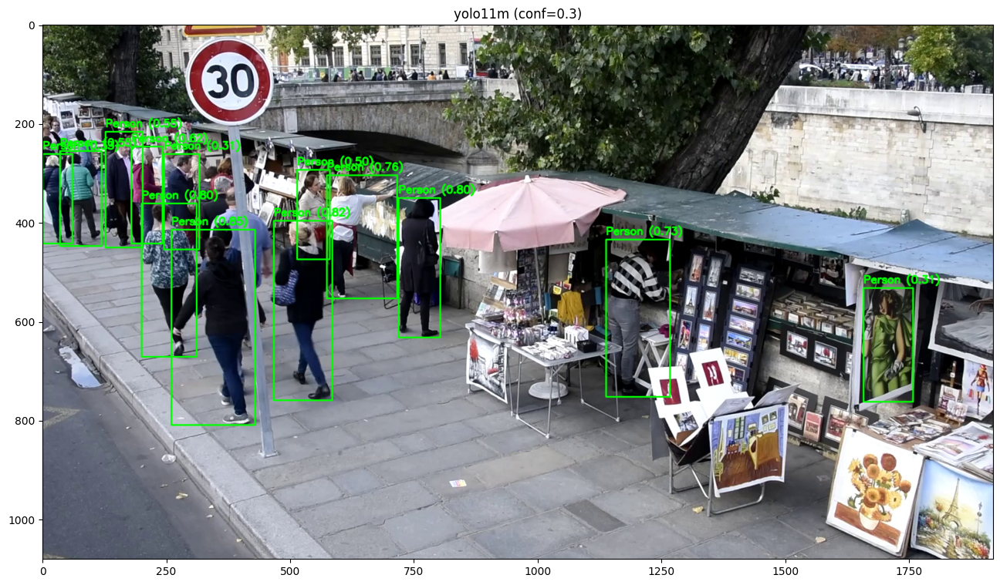

# Детекция людей на видео


## Оглавление

- [Описание](#описание)
- [Структура проекта](#структура-проекта)
- [Запуск приложения](#запуск-приложения)
- [Аргументы для запуска приложения](#аргументы-для-запуска-приложения)
- [Примеры работы](#примеры-работы)
- [Выводы](#выводы)

## Описание

Данный проект предназначен для распознавания людей на видео.

Для детекции используется предобученная модель **YOLO11** от _Ultralytics_.

Запуск программы осуществляется при помощи командной строки,
а её поведение можно настроить при помощи передаваемых аргументов,
описание которых приведено в [соответствующем разделе](#аргументы-для-запуска-приложения).
Основные сильно влияющие на результат детекции параметры
— вариация модели **YOLO11** и порог уверенности.

Во время обработки видео программа выводит в консоль строку состояния при помощи библиотеки `tqdm`
для отображения прогресса и примерного предсказания общего времени обработки.

## Структура проекта

- `main.py` — основной скрипт для обработки видеофайлов;
- `experiments.ipynb` — Jupyter-ноутбук с проведёнными экспериментами;
- `README.md` — Markdown-файл с описанием проекта ***(данный файл)***;
- `requirements.txt` — текстовый файл с перечислением зависимостей проекта;
- `.gitignore` — текстовый файл с исключёнными из Git путями;
- `example_img/` — папка с примерами результатов работы программы из конца данного файла;
  - `x02.png` — YOLO11x с confidence == 0.2;
  - `m03.png` — YOLO11m с confidence == 0.3;
  - `n02.png` — YOLO11n с confidence == 0.2.

## Запуск приложения

Для установки необходимых проекту зависимостей можно использовать команду:

```bash
pip install -r requirements.txt
```

Для запуска скрипта детекции людей на видео `input_file.mp4` можно использовать, например, команду:

```bash
python main.py -i input_file.mp4 -o output_file.mp4 -s
```

(Для запуска на UNIX-подобных системах `python` следует заменить на `python3`)

## Аргументы для запуска приложения

Данная программа реализует поддержку следующих аргументов командной строки:

| Аргумент                          |                        Описание                         | Обязательный | Возможные значения | Значение по умолчанию |
|:----------------------------------|:-------------------------------------------------------:|:------------:|:------------------:|:---------------------:|
| `-h`/`--help`                     |     Отображение справки по использованию программы      |     НЕТ      |         -          |           -           |
| `-i`/`--input` ВХОДНОЙ_ФАЙЛ.mp4   |          Указание пути до входного видеофайла           |      ДА      |         *          |           -           |
| `-o`/`--output` ВЫХОДНОЙ_ФАЙЛ.mp4 |     Указание желаемого пути до выходного видеофайла     |      ДА      |         *          |           -           |
| `-m`/`--model`                    |        Обозначение желаемой версии модели YOLO11        |     НЕТ      |   n, s, m, l, x    |           x           |
| `-c`/`--confidence` УВЕРЕННОСТЬ   |  Задание минимального порога уверенности при детекции   |     НЕТ      |     0.0 - 1.0      |         0.25          |
| `-s`/`--show`                     | Флаг, включающий отображение видео в процессе обработки |     НЕТ      |    True, False     |         False         |

Команда для запуска программы с использованием всех аргументов командной строки, кроме `help`, может выглядеть так:

```bash
python main.py -i input_file.mp4 -o output_file.mp4 -m l -c 0.3 -s
```

## Примеры работы

### Результат применения самой мощной модели YOLO11x с порогом уверенности, равным 0.2:

Ложных срабатываний нет, большинство людей на переднем плане обнаружены.


### Результат применения средней модели YOLO11m с порогом уверенности, равным 0.3:

Люди определены примерно так же хорошо, как у более мощной модели, но есть одно ложное срабатывание на картину.



### Результат применения самой легковесной модели YOLO11n с порогом уверенности, равным 0.2:

Найдено меньше людей, чем двумя другими моделями, но зато обработка происходит очень быстро.


По данным примерам видно, что все вариации YOLO могут довольно неплохо справляться с задачей,
и выбор конкретной вариации зависит от желаемых точности и скорости обработки.

И для каждой модели и каждого видео стоит отдельно подбирать порог уверенности,
так как от него очень сильно зависит качество детекции.

## Выводы

По результатам работы над проектом я сделал следующие выводы:
- Модель **YOLO11** показывает визуально достаточно хорошее качество детекции, особенно её вариация с кодом `x`;
- Так как в данном случае нет особых ограничений на скорость работы программы,
для лучшей точности стоит выбирать самую мощную модель **YOLO11x**;
- Выбор порога уверенности детекции очень сильно влияет на качество результата.

Если качество детекции, демонстрируемое **YOLO11x**, окажется недостаточным,
то можно предпринять следующие шаги для улучшения программы:
- Дообучение модели **YOLO11** на своём датасете (может оказаться очень полезным,
если изображения из обрабатываемых видео сильно отличаются от изображений из оригинального обучающего датасета);
- Выбор и использование другой модели детекции (например, **Detectron2** от _Facebook AI Research_).

Также, если выделение людей прямоугольниками недостаточно точно для глобальной решаемой задачи,
то можно вместо модели детекции использовать модель сегментации, которая будет возвращать точные контуры людей.
